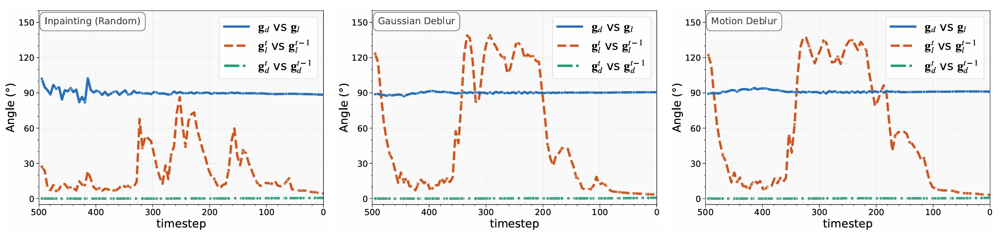
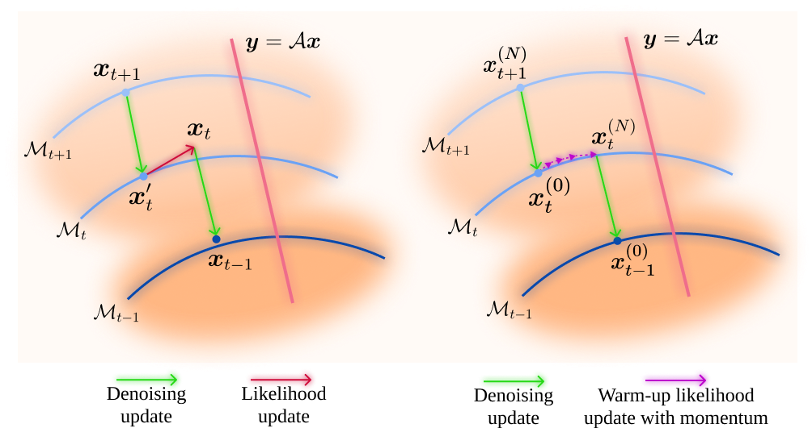

# SPGD: Enhancing Diffusion Model Stability for Image Restoration via Gradient Management

### 📝 [**Paper**](https://arxiv.org/abs/2507.06656) | 🏆 **ACM Multimedia 2025**

Official PyTorch implementation of "[Enhancing Diffusion Model Stability for Image Restoration via Gradient Management](https://arxiv.org/abs/2507.06656)".


## 🚀 Highlights

*   **Novel Gradient-Centric Analysis:** The first to identify and analyze the dual problems of *gradient conflict* and *gradient fluctuation* as key sources of instability in diffusion-based image restoration.

*   **Innovative Gradient Management (SPGD):** A new technique that directly mitigates these instabilities through two synergistic components:
    *   **Progressive Likelihood Warm-Up** to resolve conflicts before denoising.
    *   **Adaptive Directional Momentum (ADM)** to dampen erratic gradient fluctuations.


*   **Plug-and-Play Compatibility:** Easily integrated into existing diffusion posterior sampling frameworks without requiring any changes to the underlying model architecture or retraining.


## 📖 Introduction


Prominent diffusion-based image-restoration methods typically frame the conditional generation within a Bayesian inference framework, which iteratively combines a denoising step with a likelihood guidance step. However, the interactions between these two components in the generation process remain underexplored. 

In this study, we analyze the underlying gradient dynamics of these components and identify significant instabilities. Specifically, we demonstrate conflicts between the prior and likelihood gradient directions, alongside temporal fluctuations in the likelihood gradient itself.


*Figure 1: Angular relationships of gradients during the reverse process across different tasks, illustrating the gradient angles dynamics.  **Blue lines**: angle between `g_l` and `g_d`. **Orange lines**: angle between `g_l(x_t)` and `g_l(x_{t-1})`. **Green lines**: angle between `g_d(x_t)` and `g_d(x_{t-1})`.*

We show that these instabilities disrupt the generative process and compromise restoration performance.
To address these issues, we propose **Stabilized Progressive Gradient Diffusion (SPGD)**, a novel gradient management technique. SPGD integrates two synergistic components: 
1. **Progressive likelihood warm-up strategy** to mitigate gradient conflicts
2. **Adaptive directional momentum (ADM) smoothing** to reduce fluctuations in the likelihood gradient

<p align="center">
  
</p>

[//]: # (![img]&#40;README_assets/main_fig.jpg&#41;)


*Figure 2: High-level illustration of our proposed SPGD.  (a) the standard reverse process, and (b) our proposed SPGD, showing the warm-up phase with smoothed gradient to enhance restoration stability.*


## 🛠️ Getting Started

### 1. Environment Setup

- python 3.8
- PyTorch 2.3
- CUDA 12.1

```bash
# Clone the repository
git clone https://github.com/74587887/SPGD.git
cd SPGD

# Create conda environment
conda create -n SPGD python=3.8
conda activate SPGD

# Install PyTorch (adjust CUDA version as needed)
conda install pytorch==2.3.0 torchvision==0.18.0 torchaudio==2.3.0 pytorch-cuda=12.1 -c pytorch -c nvidia

# Install other dependencies
pip install -r requirements.txt
```

**Note**: Lower PyTorch versions with proper CUDA should work but are not fully tested.


### 2. Download Pretrained Checkpoints

Download the pretrained diffusion models from [DPS repository](https://drive.google.com/drive/folders/1jElnRoFv7b31fG0v6pTSQkelbSX3xGZh):

```bash
mkdir checkpoints

# Download and place checkpoints
# ffhq_10m.pt -> checkpoints/ffhq256.pt
# imagenet256.pt -> checkpoints/imagenet256.pt
```

**Optional**: For nonlinear deblur tasks, download the BKSE model from [here](https://drive.google.com/file/d/1vRoDpIsrTRYZKsOMPNbPcMtFDpCT6Foy/view?usp=drive_link):

```bash
mkdir -p forward_operator/bkse/experiments/pretrained
# Place GOPRO_wVAE.pth in the above directory
```


### 3. Quick Start Test

```bash
# Create results directory
mkdir results

# Quick test with demo images (included in repo)
python posterior_sample.py \
    +data=demo \
    +model=ffhq256ddpm \
    +task=inpainting_rand \
    +sampler=edm_spgd \
    save_dir=results \
    num_runs=1 \
    sampler.annealing_scheduler_config.num_steps=30 \
    batch_size=5 \
    data.start_id=0 data.end_id=10 \
    name=quick_test \
    gpu=0
```

This should quickly generate restored images in `results/quick_test/`.


## 🔧 Usage

### Basic Command Structure

```bash
python posterior_sample.py \
    +data={DATASET_CONFIG} \
    +model={MODEL_CONFIG} \
    +task={TASK_CONFIG} \
    +sampler=edm_spgd \
    save_dir=results \
    num_runs=1 \
    sampler.annealing_scheduler_config.num_steps=100 \
    batch_size=batch_size \
    data.start_id=0 data.end_id=100 \
    name={EXPERIMENT_NAME} \
    gpu={GPU_ID}
```

### Supported Configurations

**Model Configs** (`{MODEL_CONFIG}`):
- `ffhq256ddpm` - For FFHQ dataset
- `imagenet256ddpm` - For ImageNet dataset

**Task Configs** (`{TASK_CONFIG}`):
- `down_sampling` - Super-resolution (4× upscaling)
- `inpainting` - 128×128 box inpainting
- `inpainting_rand` - 80% random pixel inpainting
- `gaussian_blur` - Gaussian deblur (kernel size 61, intensity 3.0)
- `motion_blur` - Motion deblur (kernel size 61, intensity 0.5), from [MotionBlur](https://github.com/LeviBorodenko/motionblur) codebase
- `phase_retrieval` - Phase retrieval (oversample ratio 2.0)
- `nonlinear_blur` - Nonlinear deblur (requires [BKSE](https://github.com/VinAIResearch/blur-kernel-space-exploring) model)
- `hdr` - High dynamic range reconstruction (factor 2)

**Dataset Configs** (`{DATASET_CONFIG}`):
- `demo` - Use provided demo images
- `ffhq256` - FFHQ-256 dataset (requires manual download)
- `imagenet256` - ImageNet-256 dataset (requires manual download)

### Configuration Customization

You can modify SPGD's hyperparameters by editing the task configuration files:

```
# Edit configs/task/{TASK_CONFIG}
config:
    lr: lr           # Learning rate for likelihood guidance (typically 0.5-10)
    num_steps: N     # Number of warm-up steps (typically 1-10)
```

## 🔧 Troubleshooting

**Common Issues**:

1. **CUDA out of memory**: Reduce `batch_size` or use a GPU with more VRAM
2. **Raising ValueError**: Consider tuning (more likely, lowering) the learning rate


**Performance Tips**:
- Use `batch_size=1` for testing, larger batches for production
- Start with a small `lr`, then consider increasing it


## 🙏 Acknowledgements


Our implementation is based on and inspired by:
- [DAPS](https://arxiv.org/abs/2407.01521): https://github.com/zhangbingliang2019/DAPS
- [DPS](https://arxiv.org/abs/2209.14687): https://github.com/DPS2022/diffusion-posterior-sampling.
- [BKSE](https://github.com/VinAIResearch/blur-kernel-space-exploring) for nonlinear blur operators
- [MotionBlur](https://github.com/LeviBorodenko/motionblur) for motion blur synthesis

We gratefully acknowledge their contributions to the field.


## 📄 Citation

If you find our work useful, please kindly consider citing:

```bibtex
@article{wu2025enhancing,
  title={Enhancing Diffusion Model Stability for Image Restoration via Gradient Management},
  author={Wu, Hongjie and Zhang, Mingqin and He, Linchao and Zhou, Ji-Zhe and Lv, Jiancheng},
  journal={arXiv preprint arXiv:2507.06656},
  year={2025}
}
```
